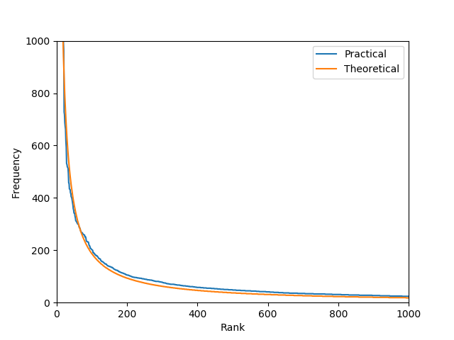

#  Accès et recherche d'information
**Auteurs** : Baptiste Bouvier et Ancelin Serre\
**Date** : 27/02/2019\
*POLYTECH GRENOBLE - INFO4*

## Arborescence du projet
```bash
.
├── readme.md
└── search_engine
    ├── engine
    │   ├── config.json
    │   ├── DataPreprocessor.py
    │   ├── main.py
    │   ├── Request.py
    │   ├── Search.py
    │   └── Utils.py
    ├── preparation
    │   ├── split_cacm.py
    │   ├── tokenize_cacm.py
    │   └── zipf.py
    └── resources
        ├── cacm
        │   ├── cacm.all
        │   ├── cite.info
        │   ├── common_words
        │   ├── qrels.text
        │   ├── query.text
        │   └── README
        └── pictures
            └── zipf.png
```

Dans le dossier `search_engine` on trouve les dossiers suivants :
- `preparation` : contient le code *Python* utilisé pour préparer le corpus de fichiers à manipuler par la suite. Cela correspond au premier TP situé [ici](https://hmul8r6b.imag.fr/doku.php?id=tp_loi_de_zipf).
- `engine` : contient le code *Python* permettant de générer et calculer le vocabulaire du corpus, les normes de ses documents, l'index inversé ainsi que la [représentation vectorielle](https://hmul8r6b.imag.fr/lib/exe/fetch.php?media=accesinfoi-ii.pdf) de **Salton** (plus d'infos [ici](https://fr.wikipedia.org/wiki/Mod%C3%A8le_vectoriel)). Ce répertoire contient également le nécesssaire pour effectuer une recherche au sein du corpus. Cet ensemble de scripts *Python* correspond aux [deuxième](https://hmul8r6b.imag.fr/doku.php?id=tp_constitution_de_vocabulaire_et_representation) et [troisième](https://hmul8r6b.imag.fr/doku.php?id=tp_recherche_et_evaluation) TP.
- `resources` : contient l'ensemble des fichiers manipulés tout au long du projet. Le corpus est basé sur le fichier nommé `cacm.all` situé dans le sous-dossier `cacm`. Ce fichier est découpé en **3204** parties traitées au fur et à mesure par les différents scripts du projet.

## Notice d'utilisation

Pour faire fonctionner ce programme, il est nécessaire de disposer de **Python 3** ou supérieur ainsi que d'effectuer les étapes ci-dessous dans l'ordre indiqué : 
- Placez-vous dans le dossier `search_engine/preparation` :
  ```bash
  cd search_engine/preparation
  ```
- Lancez la commande suivante : 
  ```bash
  python split_cacm.py
  ```
  *Indications* : cette commande découpe le fichier `cacm.all` en **3204** fichiers dans un nouveau répertoire `search_engine/resources/results/`. 

- Ensuite, il faut *"tokenizer"* chacun de ces fichiers via la commande suivante :
  ```bash
  python tokenize_cacm.py
  ```
  *Indications* : cette commande transforme chaque *terme* en minuscule et les listes sur une ligne avec un *espace* pour séparation. Cela nous permettra ensuite de faire des traitements sur ces fichiers simplement.

- (Optionnel) Les fichiers étant maintenant préparés, vous pouvez observer une illustration de la [Loi de Zipf](https://hmul8r6b.imag.fr/lib/exe/fetch.php?media=accesinfoi-ii.pdf) en utilisant la commande suivante : 
  ```bash
  python zipf.py
  ```
  Vous obtiendrez normalement les résultats suivants : 
  ```
    +----------------------------------------------------------------------+
    | Zipf's Law : λ = 18882
    | Rank  Word            Occurrence(s)   Theoretical     Probability (%)
    +----------------------------------------------------------------------+
    |  1    the             11018           18882           6.2733
    |  2    of              9031            9441            5.142
    |  3    and             4536            6294            2.5827
    |  4    to              3771            4720            2.1471
    |  5    is              3727            3776            2.122
    |  6    in              3446            3147            1.962
    |  7    cacm            3204            2697            1.8243
    |  8    for             3164            2360            1.8015
    |  9    are             1988            2098            1.1319
    |  10   algorithm               1544            1888            0.8791
    +----------------------------------------------------------------------+
    | Total number of word = 175633
    +----------------------------------------------------------------------+
  ```
  Ainsi que le graphique suivant :
  
  

- Maintenant que les fichiers sont préparés, on peut commencer à effectuer des requêtes. Il faut d'abord ce placer dans le répertoire `search_engine/engine/` : 
  ```bash
  cd search_engine/engine
  ```

- Il suffit désormais de lancer la commande suivante : 
  ```bash
  python main.py
  ```
  *Indications* : il existe plusieurs paramètres pour ce programme : 
  * `--config [my_configfile.json]`, permet à l'utilisateur de chosir ses propres chemins vers lesquels peuvent être rangés les différents fichiers manipulés au cours du programme comme les mots filtrés, les mots tokenizé ou encore le répertoire de sortie pour ranger les fichiers `.json` générés.\
  Cet argument est **OPTIONNEL**, le programme prévoit des chemins par défaut afin d'assurer un bon fonctionnement.\
  Le fichier de configuration se présente comme suit : 
  ```json
  {
    "common_words"    : "../resources/cacm/common_words",
    "tokenized_files" : "../resources/tokenized/",
    "filtered_files"  : "../resources/stop_words_filtered/",
    "result_files"    : "../resources/results/",
    "generated_files" : "../resources/generated_files/"
  }
  ```
    
  * `--save`, argument permettant d'indiquer si l'utilisateur souhaite sauvegarder les fichiers générés ou non.\
  Par défaut les fichiers générés seront sauvegardé dans le répertoire `search_engine/resources/generated_files/` 

  Une fois lancé, le programme va générer un certain nombre de fichiers ce qui devrait prendre aux alentours d'une minute. Une fois cela effectué, vous pourrez entrer la requête de votre choix ainsi qu'un nombre de réponses attendu puis le moteur de recherche se chargera du reste et cherchera sur le corpus des correspondances et les fichiers les plus pertinents vis à vis de la requête.

  ```bash
  # Exemple d'exécution :
  python main.py --save

  # Warning happens when the directory already exists
  [Warning] Creation of the directory ../resources/stop_words_filtered/ failed
  [DP] Initiating corpus vocabulary... 
  [DP] OK
  [DP] Initiating Salton vector representation...
  [DP] OK
  [DP] Initiating Inverted index...
  [DP] OK
  [DP] Initiating Norms list...
  [DP] OK
  [Warning] Creation of the directory ../resources/generated_files/ failed
  [SearchEngine] >> Enter your request : my request
  [SearchEngine] >> Enter the number of results you want : 5
  ```
  Pour quitter l'application, il suffit d'appuyer sur `Enter` lorsque le programme demande d'entrer une requête ou le nombre de réponses attendues.